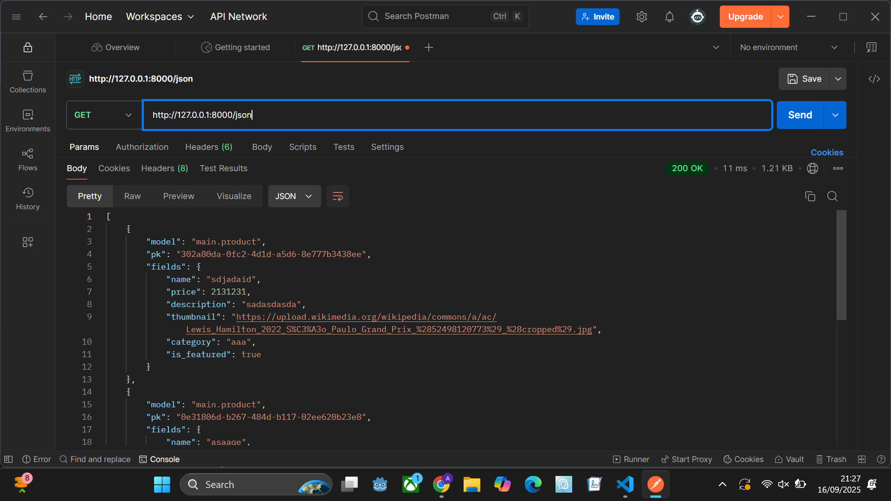
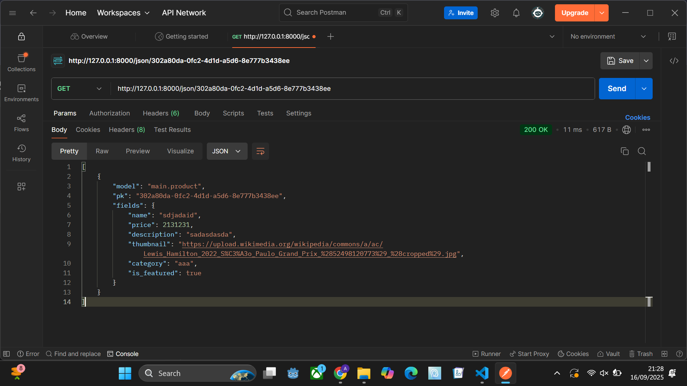
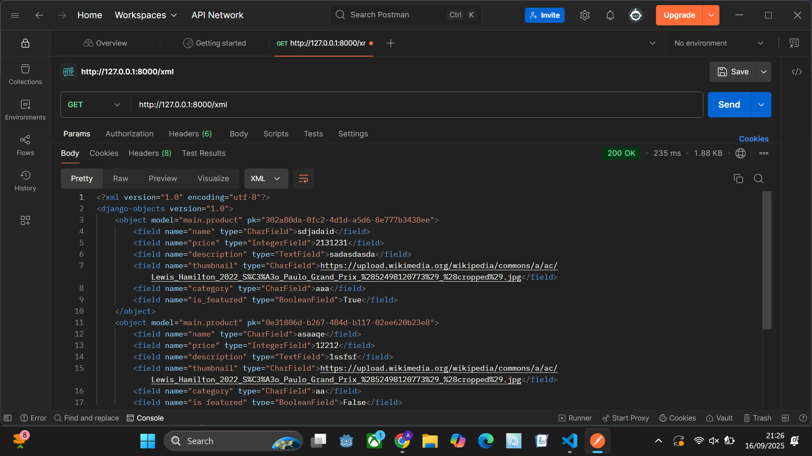
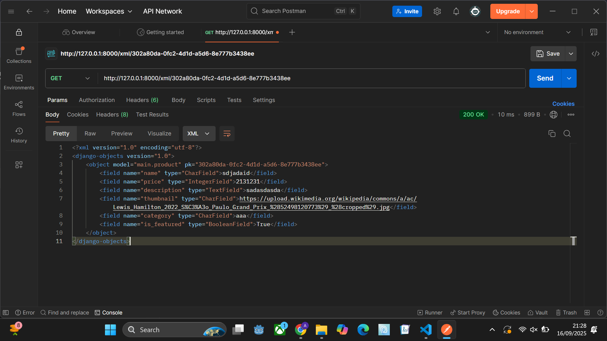

# Web

https://aufa-daffa-footballshop.pbp.cs.ui.ac.id/

# Penjelasan Tugas 2

## 1. 

### Pertama-tama, kita dapat membuat sebuah folder baru, jalankan virtual environment, kemudian, kita buat sebuah file requirements.txt yang berisi dependencies untuk proyek Django kita. Lalu, kita bisa menginstal dependencies tersebut lalu kita buat proyek Django dengan perintah ` django-admin startproject football_news . `

### Setelah itu, kita dapat membuat file .env, .env.prod dan  .gitignore agar mengatur environment variable kita dan agar file tersebut tidak terkena push ke github. 

### Kemudian, kita akan membuat sebuah app dengan nama 'main' 

` 
python manage.py startapp main
`

Kemudian, kita daftarkan 'main' tadi ke settings.py di bagian INSTALLED_APPS

### Pada football_shop/urls.py, kita tambahkan root url ke app main

### Buka berkas models.py yang ada di app main kita. Lalu, modifikasi sesuai dengan apa saja data/atribut yang akan dimiliki. Ada satu atribut yang wajib, yaitu id. 

### Selanjutnya, buka file views.py, di sana, kita definisikan method baru untuk dikembalikan ke html. Kita dapat mengisinya dengan data yang akan ditampilkan di html nanti

### Selanjutnya, buka urls.py di bagian app, lalu kita isi dengan endpoint dan apa nama method yang telah kita definisikan di views.py tadi. Jangan lupa untuk melakukan import terlebih dahulu

### Terakhir, kita akan melakukan deployment ke pws. Pertama tama, kita sambungkan dulu proyek lokal kita ke proyek github. Kita inisialisasi terlebih dahulu git

`
git init
git remote add origin <url proyek github>
git add . 
git commit -m "<isi comment>
git push origin master
`

### Selanjutnya, kita akan mendeploy ke pws. Ikuti petunjuk yang ada di pws, jangan lupa untuk konfigurasi settings.py agar bisa diakses oleh pws, dan edit environs di pws dengan data yang ada di .env.prod yang kita miliki

## 2. 

### Pada halaman utama, ada sebuah tombol bertuliskan "Ke Dashboard" yang akan mengalihkan tampilan halaman pengguna ke halaman dashboard. Pertama, kita bisa membuat satu file html baru yang kita beri nama dashboard.html, kemudian, kita tambahkan file dashboard.html tadi ke file urls.py. Di sana, kita tambahkan endpoint untuk dashboard.html tadi, contohnya kita menggunakan dashboard/. models.py dapat kita gunakan jika kita ingin menambahkan model untuk dashboard.html

## 3. 

### settings.py di django berguna untuk mengatur konfigurasi proyek Django, seperti pengaturan database, middleware, aplikasi mana yang di-install, siapa saja yang bisa mengakses (ALLOWED_HOSTS), internalization, static files, authentication, dan lain-lain. 

## 4. 

### Saat kita menulis model di models.py, kita sebenarnya akan menulis object untuk SQL. Akan tetapi, untuk mempermudah, kita dapat menggunakan bahasa python. Migrasi ini bertujuan untuk mengubah model yang kita tulis dalam bahasa python untuk di-eksekusi dan dicatat di SQL. Mekanismenya adalh dengan kita menjalankan perintah untuk migrasi sehingga django akan bikin file di folder migrations/.

## 5. 

### Saya mendengar bahwa django merupakan framework yang ramah untuk pemula web development dibandingkan dengan framework yang lain, seperti spring, axum, dan lain-lain.

## 6. 

### Saya rasa masih tidak ada perlu yang dikoreksi. Mungkin ini dikarenakan topik yang masih tidak membingungkan, cukup ikuti saja tutorial yang ada di dokumentasi yang tersedia.

# Penjelasan Tugas 3

## 1.

### Dalam membuat aplikasi, jelas kita perlu berinteraksi dengan data. Mulai dari data sederhana seperti apakah pengguna sudah login, hingga data kompleks, kita tidak bisa lepas dari data. Dengan dmeikian, data delivery merupakan sesuatu yang sangat penting dalam membuat aplikasi

## 2.

### Saya rasa, sebagai praktisi, JSON lebih baik daripada XML karena JSON lebih populer digunakan yang mengakibatkan pembelajarannya menjadi lebih mudah dibanding XML. Semenjak javascript sangat banyak digunakan dalam pengembangan front end, penggunaan JSON menjadi sangat populer karena JSON berasal dari object javascript.

## 3.

### is_valid() digunakan untuk mengecek apakah data / form yang dikirim user merupakan form yang valid sesuai dengan peraturan yang kita tulis di forms.py (Untuk kasus di sini, forms.py mengikuti aturan yang ada di models.py seperti max length dan sebagainya).

## 4.

### Kita perlu menambahkan "csrf_token" dalam form. Ini untuk mencegah adanya penyerang yang mengirim request menggunakan cookie yang dimiliki oleh user tanpa sepengetahuan user. Penyerang dapat memanfaatkan ini dengan membuat sebuah tombol untuk mengirim request jahat ke aplikasi. csrf_token menangkal ini dengan membuat sebuah token yang nantinya nilai token ini akan dibandingkan dengan nilai token saat user mengirim request.

## 5.

### Checklist 1

#### Kita mulai dengan membuat 4 fungsi di views.py: show_xml, show_xml_by_id, show_json, show_json_by_id. Dengan ide mengembalikan semua object. Lalu, format dalam python tadi diubah ke format json dan xml dengan serializers. Terakhir, kita akan return HttpResponse

### Checklist 2

#### Lalu, kita dapat menambahkan path di urls.py agar kita bisa mengakses fungsi yang sudah kita definisikan di views.py tadi. Caranya, kita import terlebih dahulu fungsi-fungsi tadi ke urls.py. Setelah itu, kita tambahkan ke urlpatterns. 

### Checklist 3

#### Di line 15 pada file main.html, kita menambahkan sebuah blok "<a>" yang di dalamnya kita redirect ke url tempat "add_jersey" berada (pakai "add_jersey" karena kita menggunakan itu dalam "name" di urlpatterns). Untuk detail jersey, kita juga melakukan yang hampir sama. Akan tetapi, kali ini kita menambahkan "jersey.id" dalam href karena url jersey membutuhkan id dari jersey

### Checklist 4

#### Pertama-tama, kita harus membuat fungsi add_jersey di views.py. Di sana, kita isi dengan form bersama request POST (karena kita akan mengirim, bukan mengambil) lalu tambahkan if conditional untuk mengecek apakah form yang diisi oleh pengguna sesuai dengan kriteria yang kita deklarasikan di models.py. Lalu, kita kasih context dan kita return

#### Lalu, kita daftarkan ke urls.py seperti biasa. Tidak lupa, kita juga harus membuat file html-nya. Di sini, kita membuat file add_jersey.html yang diisi dengan blok "<form>" dengan metode POST. Jangan lupa juga untuk menambahkan  agar aplikasi kita lebih aman.

### Checklist 5

#### Untuk detail jersey, kita melakukan yang hampir sama dengan add_jersey. Akan tetapi, kali ini kita menambahkan "jersey.id" dalam href karena url jersey membutuhkan id dari jersey

### Checklist 6

#### Kita isi readme.md sesuai petunjuk di soal

### Checklist 7

#### Kita install postman terlebih dahulu, kemudian kita bisa nyalakan server dari aplikasi kita. Setelah itu, kita dapat memasukkan url yang kita miliki untuk di-test di postman

### Checklist 8

#### Kita bisa buka vs code, lalu menuju bagian source control. Di sana, kita dapat langsung mengisi pesan commit. Lalu, kita tinggal pilih commit & push

## 6.

### Tidak ada. Saya rasa asdos sudah cukup baik :>

## Hasil mengakses URL menggunakan postman

### JSON

### JSON Dengan Id

### XML

### XML Dengan Id

# Penjelasan Tugas 4

## 1.

### Sederhananya, AuthenticationForm adalah template form digunakan pengguna untuk login ke aplikasi yang kita buat. Kelebihannya, kita hanya perlu mengimport template yang sudah diberikan django ini tanpa perlu format keamanannya, logika login berhasil / gagal sehingga developer dapat menghemat waktu. Kelemahannya, AuthenticationForm ini kurang fleksibel untuk diformat sesuka developer.

## 2.

### Autentikasi adalah proses untuk mengidentifikasi siapa pengguna tertentu (apakah pembeli, penjual, atau admin). Otorisasi adalah apa saja yang dapat dilakukan oleh role tersebut. Ada beberapa metode seperti has_view_permission(), has_add_permission(), has_change_permission() dan has_delete_permission() yang dapat digunakan untuk mengatur otoritas suatu method. Untuk authentikasi, django menyediakan "AuthenticationForm" yang dapat digunakan dengan mudah.

## 3.

### Salah satu keuntungan dari menyimpan state di cookies adalah data disimpan di browser pengguna. Hal ini dapat meringankan beban yang dialami oleh server. Kelemahannya, cookies lebih rentan dengan serangan berbahaya seperti XSS dan CSRF jika dikonfigurasi dengan salah. Untuk session, karena state disimpan di server, state akan lebih susah untuk terkena serangan. Kelemahannya, kebalikan dari cookies, session akan memberikan beban ke server karena data disimpan di server (terutama ketika ada banyak pengguna yang mengakses aplikasi).

## 4.

### Secara default, penggunaan cookies tidak aman bagi pengembangan web. Salah satu alasannya adalah rentannya cookies akan serangan XSS dan CSRF. Django sendiri memiliki fitur bawaan yang dapat menangkal berbagai macam serangan CSRF selama kita menggunakannya dengan benar. Saat kita deploy aplikasi kita dengan HTTPS, CsrfViewMiddleware akan mengecek apakah HTTP header itu di-set ke URL yang asalnya sama (termasuk subdomain dan port).

## 5.

### Checkpoint 1

#### Pertama-tama, kita import: 

` from django.contrib.auth.forms import UserCreationForm `
` from django.contrib import messages `
` from django.contrib.auth.forms import UserCreationForm, AuthenticationForm `
` from django.contrib.auth import authenticate, login `
` from django.contrib.auth import authenticate, login, logout `
 

#### di main/views.py
 
